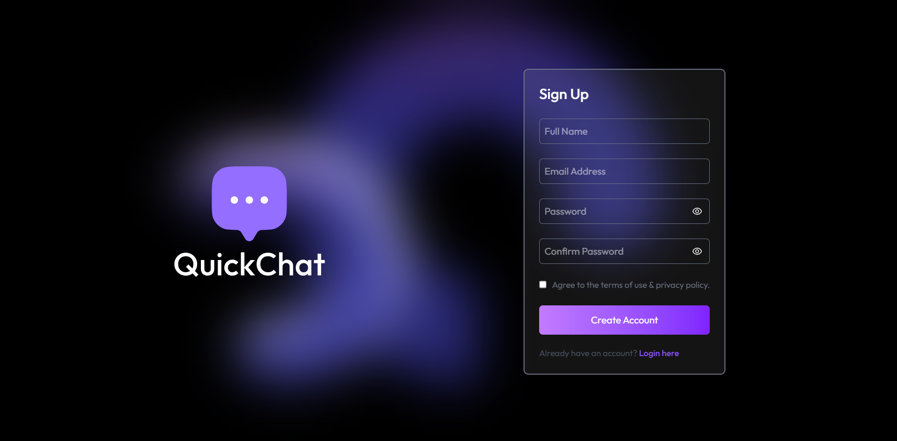
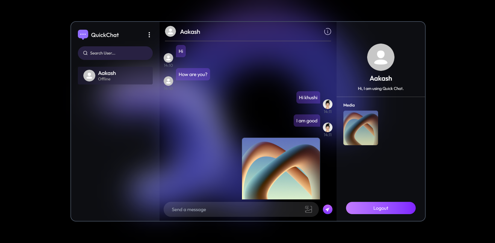

<h1 align="center">💬 Chat App: Real-Time Messaging Platform</h1>

<p align="center">
  💬 <strong>Chat App</strong> is a modern full-stack messaging platform designed to enable seamless real-time communication between users. Built using the <strong>MERN stack</strong> (MongoDB, Express.js, React.js, Node.js) and Socket.IO, it provides an interactive and responsive interface where users can create accounts, securely log in, and exchange messages instantly. The backend leverages JWT for authentication and bcrypt for secure password management, while chat histories are persistently stored in MongoDB. This project is perfect for developers looking to learn about real-time applications, state management in React, and integrating frontend and backend technologies in a scalable, modular architecture.
</p>

<p align="center">
  
  
  
  
  
  
</p>

---

## 🔥 Features

- 🔐 JWT-based user authentication and authorization
- 🛡️ Secure password storage with bcrypt
- 💬 Real-time messaging with Socket.IO
- 🗂️ Persistent chat history with MongoDB
- 🌐 Responsive and interactive React front-end
- ⚙️ RESTful API with Express.js backend
- 📦 Modular project structure (client & server separation)

---

## 📁 Project Structure

```bash
Chat_App/
│
├── chat-app/               # React front-end
│   ├── context/            # React Context for state management
│   ├── public/             # Static assets (index.html, favicon, etc.)
│   ├── screenshots/        # Screenshots for README
│   ├── src/
│   │   ├── assets/         # Images, icons, and other static files
│   │   ├── components/     # Reusable UI components
│   │   ├── lib/            # Utility functions and libraries
│   │   ├── pages/          # React pages (Chat, Login, Register, etc.)
│   │   ├── App.jsx         # Main React component
│   │   ├── main.jsx        # React app entry point
│   │   └── index.css       # Global CSS styles
│   └── .env                # Frontend environment variables (e.g., VITE_BACKEND_URL)
│
├── server/                 # Express & Node.js backend
│   ├── controllers/        # Route logic
│   ├── models/             # Mongoose schemas
│   ├── routes/             # Express routes
│   ├── middleware/         # Auth & error handling
│   ├── lib/                # Helper functions & libraries
│   ├── server.js           # Main server file
│   ├── package.json
│   └── .env                # Backend environment variables (DB, JWT, Cloudinary, etc.)
│       
└── README.md               # You're here!

```

---

## 🚀 Getting Started

### 1️⃣ Clone the repo

```bash
git clone https://github.com/coderajawat/chat-app.git
cd chat-app
```

### 2️⃣ Install dependencies
```bash
# Install backend dependencies
cd server
npm install

# Install frontend dependencies
cd chat-app
npm install
```

### 3️⃣ Setup environment variables

1. Create a .env file in the Backend folder:
```bash
# MongoDB connection string
MONGODB_URI=your_mongodb_connection_string

# Server port
PORT=5000

# JWT secret for authentication
JWT_SECRET=your_jwt_secret_key

# Cloudinary credentials for image uploads (if needed)
CLOUDINARY_CLOUD_NAME=your_cloudinary_cloud_name
CLOUDINARY_API_KEY=your_cloudinary_api_key
CLOUDINARY_API_SECRET=your_cloudinary_api_secret

# Email credentials for sending notifications
MAIL_USER=your_email@example.com
MAIL_PASSWORD=your_email_password

# Frontend URL (used in CORS or email links)
FRONTEND_URL=https://your-frontend-deployed-url.com
```
2. Create a .env file in the chat-app (client) folder:
```bash
VITE_BACKEND_URL=https://your-backend-deployed-url.com
```
### 4️⃣ Start the development server

```bash
# Start backend
cd server
node server.js

# Start frontend
cd chat-app
npm start
```

Go to 👉 [http://localhost:5173](http://localhost:5173) 

---

## 🖼️ Screenshots

<div align="center">
  
  <br /><br /><hr /><br /><br />
  
</div>

---

## 🧠 Concepts You'll Learn

- Full-stack development with MERN (MongoDB, Express, React, Node.js)
- Real-time communication with Socket.IO
- Secure authentication with JWT and bcrypt
- Managing state in React for dynamic UI updates
- RESTful API design and backend architecture
- Modular project structure for scalability

---

## 👨‍💻 Developer

*Khushi Rajawat*  
🌐 [LinkedIn](https://www.linkedin.com/in/khushi-rajawat-34309a211/) 
📫 Email: [khushirajawat755@gmail.com](mailto:khushirajawat755@gmail.com)  

---

## 📄 License

This project is licensed under the *MIT License*.  
Feel free to use, fork, and contribute 💙

---

<p align="center">
  ⭐ If you found this project helpful or inspiring, please give it a star!
</p>
